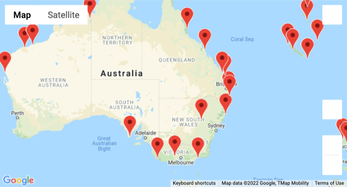
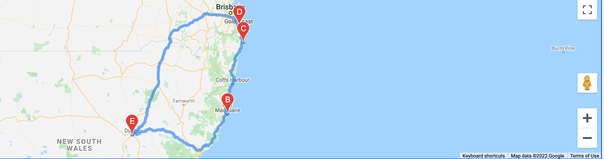

# Weather_API_Analysis_in_Jupyter
API weather data analysis to book a vacation in Jupyter notebooks

## Overview of Project
Using weather and GoogleMaps APIs, I created weather references which will determine potential travel destinations and nearby hotels for an app.

## Summary
I created a sample user input of certain max and min temperatures that a user might input to create a list of travel destinations around the world with a marker layer map. 

From a list of travel destinations, I choose 4 cities in Australia to create a travel itinerary. The travel itinerary also includes a travel route between the 4 cities  using the Google Maps Directions API.

